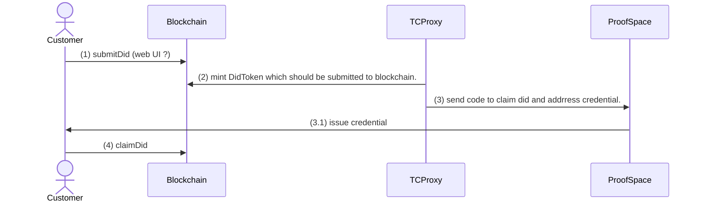
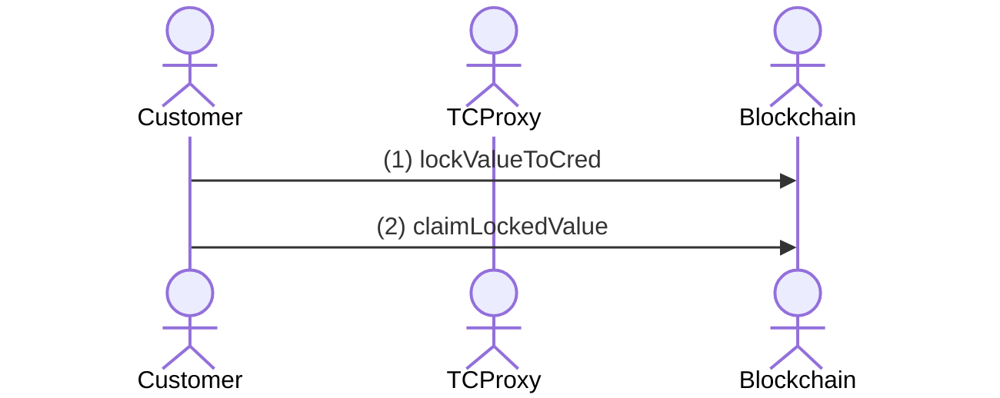
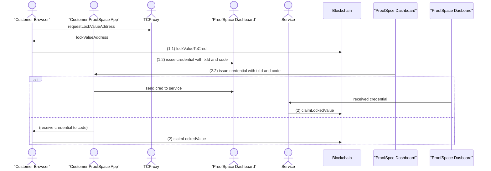
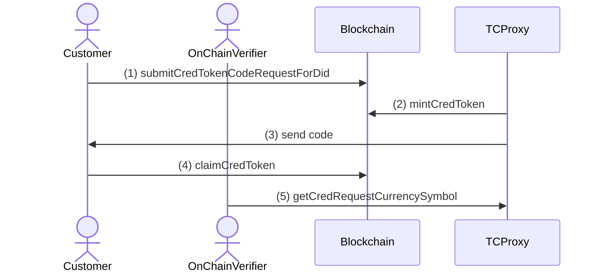
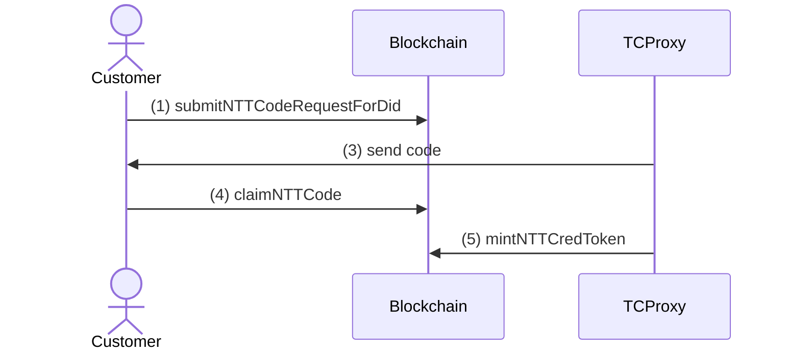
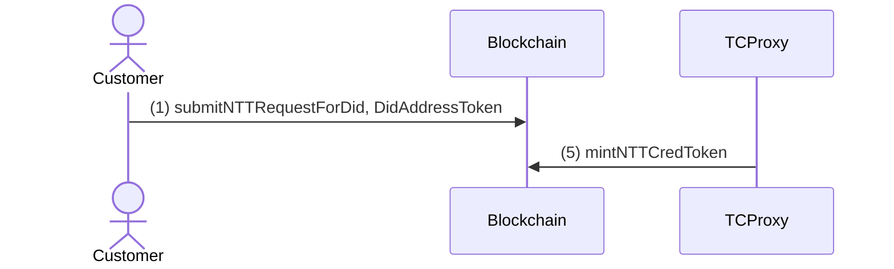

# Token-Based credential.

## Association ot DID and address

## Lock Value

### LockValue: web

#  Credential-based token

## Issue NFT or DAT by code

## Issue NTT by code

NTT (Not transferrable token) can be minted only for given address
 so we should have other schema for minting one.

## Issue NTT by did-address

