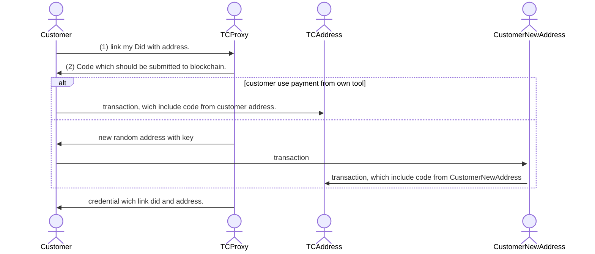

 # Token-Based credential.

## Association ot DID and address

```mermaid
sequenceDiagram
actor Customer
actor TCProxy
actor TCAddress
actor CustomerNewAddress
Customer ->> TCProxy: (1) link my Did with address.
TCProxy ->> Customer: (2) Code which should be submitted to blockchain.
alt customer use payment from own tool
  Customer ->> TCAddress: transaction, wich include code from customer address.
else
  TCProxy ->> Customer: new random address with key
  activate CustomerNewAddress
  Customer ->> CustomerNewAddress: transaction
  CustomerNewAddress ->> TCAddress: transaction, which include code from CustomerNewAddress
end
TCProxy ->> Customer: credential wich link did and address.
```

